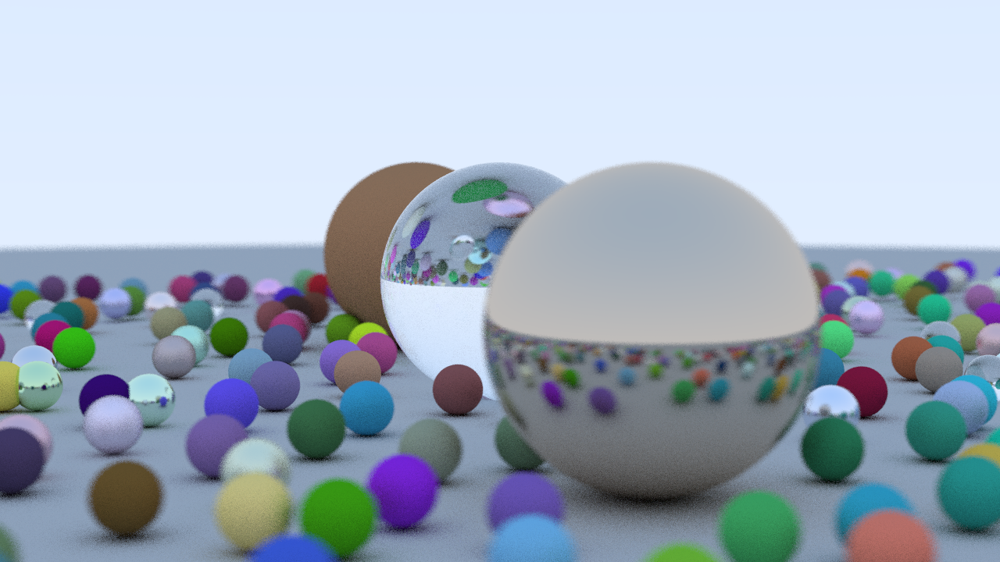

# Rust とレイトレーシング完全に理解した

1280 \* 720, 32 samples, レンダリング時間：2:10:31.18 on Thinkpad E14

- 形状
  - ✅ 球
  - ❌ その他の形状
- マテリアル
  - ✅ ランバート
    - アルベド
  - ✅ 導体
    - アルベド
    - ラフネス
  - ✅ 電誘体
    - 屈折率
  - ❌ テクスチャ
  - ❌ 発光
  - ❌ PBR シェーダー
- カメラ
  - ✅ LookAt 指定
- レンダー
  - ✅ アンチエイリアシング（マルチサンプリング）
  - ✅ 被写界深度
  - ❌ モンテカルロレイトレーシング
  - ❌ 重点的サンプリング
  - ❌ デノイジング
  - ❌ アニメーション

## 参考資料

- [Rust ではじめるレイトレーシング入門](https://github.com/mebiusbox/docs/blob/master/Rust%E3%81%A7%E3%81%AF%E3%81%98%E3%82%81%E3%82%8B%E3%83%AC%E3%82%A4%E3%83%88%E3%83%AC%E3%83%BC%E3%82%B7%E3%83%B3%E3%82%B0%E5%85%A5%E9%96%80.pdf)
- [週末レイトレーシング](https://inzkyk.xyz/ray_tracing_in_one_weekend/)
- [Ray Tracing in One Weekend](https://raytracing.github.io/books/RayTracingInOneWeekend.html)

ありがとうございます
